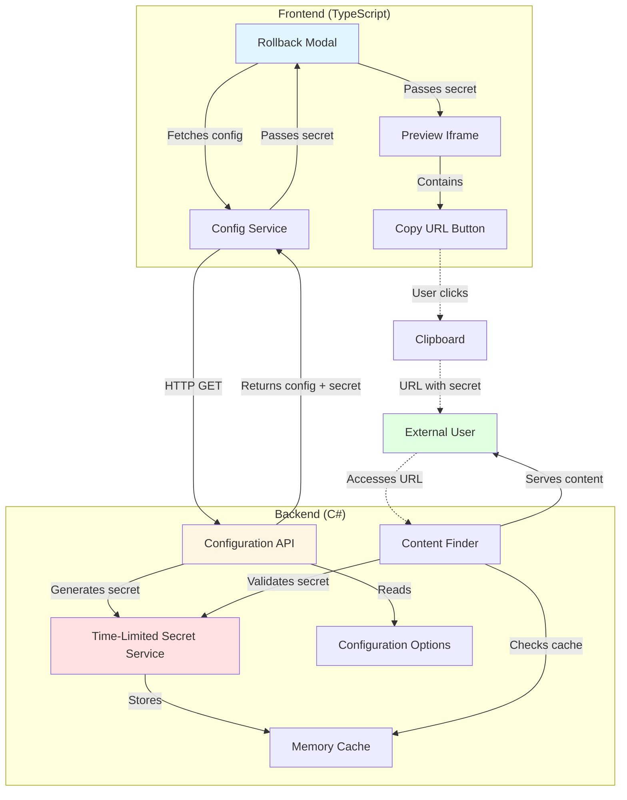
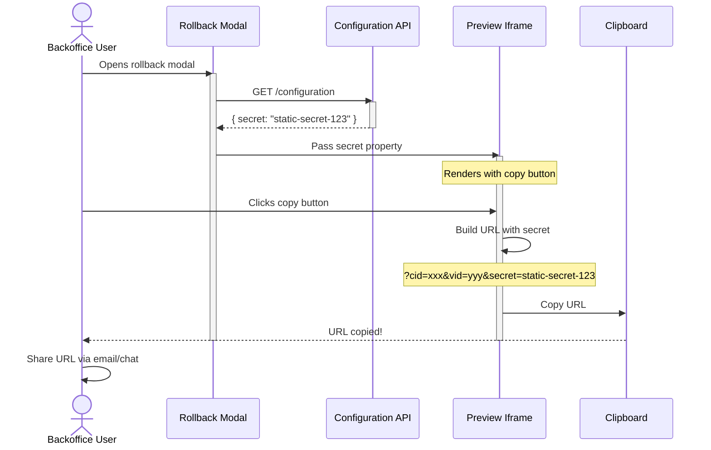
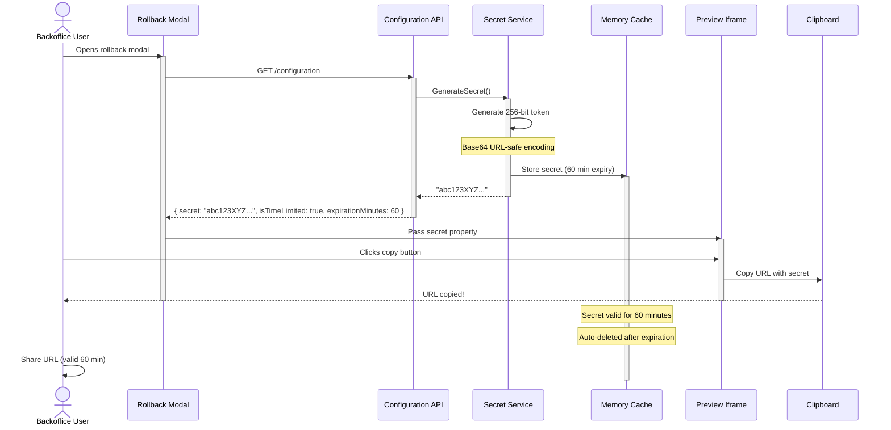
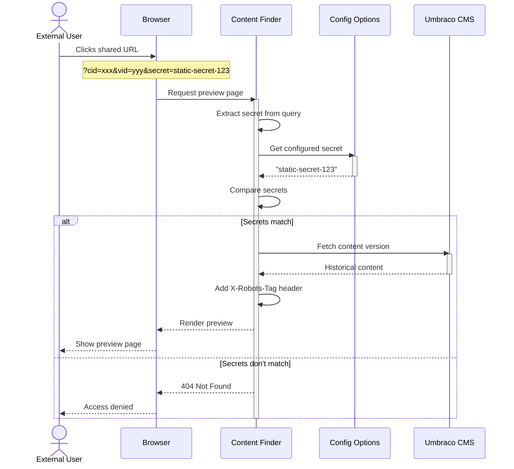
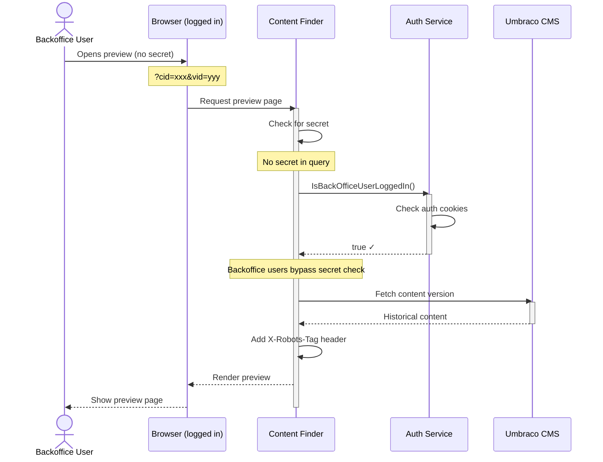
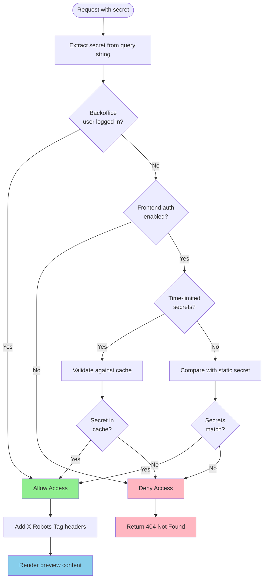

# Shareable Preview Links Feature

## Overview

The Shareable Preview Links feature enables Umbraco backoffice users to share rollback preview URLs with non-authenticated users (clients, stakeholders, team members without backoffice access). This allows external parties to view historical content versions without requiring Umbraco backoffice credentials.

## Key Capabilities

### For Backoffice Users
- ✅ **One-click URL copying** - Copy shareable preview URLs directly from the rollback modal
- ✅ **Visual indicator** - UUI-styled button with link icon in top-right corner of previews
- ✅ **Automatic secret inclusion** - Secret tokens are automatically appended to URLs
- ✅ **Dual secret modes** - Choose between static or time-limited secrets
- ✅ **No manual configuration** - Secrets are fetched and applied automatically

### For Non-Backoffice Users
- ✅ **No authentication required** - View previews without logging into Umbraco
- ✅ **Direct URL access** - Simply click the shared link to view content
- ✅ **Side-by-side comparison** - See both current and historical versions
- ✅ **Time-limited access** - Optional automatic URL expiration for security

### Security Features
- ✅ **Secret-based authorization** - Only users with the correct secret can access previews
- ✅ **Time-limited secrets** - Optional expiring tokens (default: 60 minutes)
- ✅ **SEO protection** - `X-Robots-Tag: noindex, nofollow` prevents search engine indexing
- ✅ **Backoffice bypass** - Logged-in backoffice users always have access
- ✅ **Configurable expiration** - Adjust secret lifetime to match your security requirements

## Configuration

### Basic Setup (Static Secrets)

Add the following to your `appsettings.json`:

```json
{
  "RollbackPreviewer": {
    "EnableFrontendPreviewAuthorisation": true,
    "FrontendPreviewAuthorisationSecret": "your-secure-secret-here"
  }
}
```

**Characteristics:**
- ✅ Simple configuration
- ✅ Single secret for all users
- ✅ URLs remain valid indefinitely
- ⚠️ Requires manual secret rotation
- ⚠️ Same secret used for all share actions

### Advanced Setup (Time-Limited Secrets)

For enhanced security, enable time-limited secrets:

```json
{
  "RollbackPreviewer": {
    "EnableFrontendPreviewAuthorisation": true,
    "EnableTimeLimitedSecrets": true,
    "SecretExpirationMinutes": 60
  }
}
```

**Characteristics:**
- ✅ New secret generated for each share
- ✅ Automatic expiration after configured duration
- ✅ No manual secret rotation needed
- ✅ Reduced exposure window
- ✅ Per-session isolation

### Configuration Options Reference

| Option | Type | Default | Description |
|--------|------|---------|-------------|
| `EnableFrontendPreviewAuthorisation` | bool | `false` | Enable secret-based authorization for frontend preview access |
| `FrontendPreviewAuthorisationSecret` | string | `null` | Static secret for authorization (used when `EnableTimeLimitedSecrets` is false) |
| `EnableTimeLimitedSecrets` | bool | `false` | Use time-limited, dynamically generated secrets instead of static secrets |
| `SecretExpirationMinutes` | int | `60` | Expiration time in minutes for time-limited secrets |

### Configuration Scenarios

#### Scenario 1: No Authorization (Development)
```json
{
  "RollbackPreviewer": {
    "EnableFrontendPreviewAuthorisation": false
  }
}
```
- Backoffice users have access
- No frontend/public access allowed

#### Scenario 2: Open Frontend Access
```json
{
  "RollbackPreviewer": {
    "EnableFrontendPreviewAuthorisation": true,
    "FrontendPreviewAuthorisationSecret": null
  }
}
```
- Anyone with the URL can access previews
- No secret validation
- ⚠️ Not recommended for production

#### Scenario 3: Static Secret (Simple Sharing)
```json
{
  "RollbackPreviewer": {
    "EnableFrontendPreviewAuthorisation": true,
    "FrontendPreviewAuthorisationSecret": "my-long-secure-secret-123"
  }
}
```
- Single secret shared with all users
- URLs valid indefinitely
- Manual secret rotation required

#### Scenario 4: Time-Limited Secrets (Maximum Security)
```json
{
  "RollbackPreviewer": {
    "EnableFrontendPreviewAuthorisation": true,
    "EnableTimeLimitedSecrets": true,
    "SecretExpirationMinutes": 30
  }
}
```
- New secret per share
- Auto-expires after 30 minutes
- No secret management needed

## Architecture

### System Components



### Component Responsibilities

| Component | Responsibility |
|-----------|---------------|
| **Rollback Modal** | Fetches configuration on load, passes secret to iframes |
| **Preview Iframe** | Displays preview content, contains copy button |
| **Config Service** | Fetches configuration from backend API |
| **Copy URL Button** | Appends secret to URL and copies to clipboard |
| **Configuration API** | Generates/returns secrets based on configuration |
| **Time-Limited Secret Service** | Generates cryptographically secure tokens, validates against cache |
| **Content Finder** | Intercepts preview requests, validates authorization |
| **Memory Cache** | Stores time-limited secrets with automatic expiration |

## User Flows

### Flow 1: Backoffice User Sharing Preview (Static Secret)



### Flow 2: Backoffice User Sharing Preview (Time-Limited Secret)



### Flow 3: Non-Backoffice User Accessing Preview (Static Secret)



### Flow 4: Non-Backoffice User Accessing Preview (Time-Limited Secret)

```mermaid
sequenceDiagram
    actor ExternalUser as External User
    participant Browser as Browser
    participant Finder as Content Finder
    participant SecretSvc as Secret Service
    participant Cache as Memory Cache
    participant Umbraco as Umbraco CMS

    ExternalUser->>Browser: Clicks shared URL
    Note over Browser: ?cid=xxx&vid=yyy&secret=abc123XYZ...
    Browser->>Finder: Request preview page
    activate Finder

    Finder->>Finder: Extract secret from query
    Finder->>SecretSvc: ValidateSecret("abc123XYZ...")
    activate SecretSvc
    SecretSvc->>Cache: Check if secret exists
    activate Cache

    alt Secret found in cache (not expired)
        Cache-->>SecretSvc: true
        SecretSvc-->>Finder: Valid ✓
        deactivate SecretSvc
        Finder->>Umbraco: Fetch content version
        activate Umbraco
        Umbraco-->>Finder: Historical content
        deactivate Umbraco
        Finder->>Finder: Add X-Robots-Tag header
        Finder-->>Browser: Render preview
        Browser-->>ExternalUser: Show preview page
    else Secret not found or expired
        Cache-->>SecretSvc: false
        deactivate Cache
        SecretSvc-->>Finder: Invalid ✗
        deactivate SecretSvc
        Finder-->>Browser: 404 Not Found
        Browser-->>ExternalUser: Access denied
    end
    deactivate Finder
```

### Flow 5: Backoffice User Accessing Preview (No Secret Required)



## URL Structure

### Preview URL Format

```
https://yoursite.com/ucrbp?cid={contentId}&vid={versionId}&culture={culture}&secret={secret}
```

### Parameters

| Parameter | Required | Description | Example |
|-----------|----------|-------------|---------|
| `cid` | ✓ | Content GUID (or int for older Umbraco versions) | `123e4567-e89b-12d3-a456-426614174000` |
| `vid` | ✓ | Version GUID (or int for older Umbraco versions) | `789e4567-e89b-12d3-a456-426614174111` |
| `culture` | | Culture/language code | `en-US` |
| `secret` | * | Authorization secret token | `abc123XYZ...` |

*Required when `EnableFrontendPreviewAuthorisation` is enabled

### Example URLs

**Static Secret:**
```
https://mysite.com/ucrbp?cid=123e4567&vid=789e4567&culture=en-US&secret=my-static-secret
```

**Time-Limited Secret:**
```
https://mysite.com/ucrbp?cid=123e4567&vid=789e4567&culture=en-US&secret=vK8jT2pL4mN9qR5wX3yZ1bC6dF0hG7
```

**No Secret (Backoffice Only):**
```
https://mysite.com/ucrbp?cid=123e4567&vid=789e4567&culture=en-US
```

## Security Considerations

### Secret Generation (Time-Limited Mode)

- **Algorithm**: Cryptographically secure random number generator (RNG)
- **Token Size**: 256 bits (32 bytes)
- **Encoding**: Base64 URL-safe encoding (no `+`, `/`, or `=` characters)
- **Storage**: In-memory cache with automatic expiration
- **Uniqueness**: Each generated secret is statistically unique

### Validation Flow



### Security Best Practices

#### ✅ Do's
- ✅ **Use time-limited secrets in production** - Minimizes exposure window
- ✅ **Set appropriate expiration times** - Balance usability vs security (30-120 minutes)
- ✅ **Use HTTPS** - Encrypt secrets in transit
- ✅ **Monitor access patterns** - Log preview access for auditing
- ✅ **Rotate static secrets regularly** - If using static mode, change periodically
- ✅ **Share URLs securely** - Use encrypted channels (email, secure chat)

#### ❌ Don'ts
- ❌ **Don't use static secrets in production** - Prefer time-limited mode
- ❌ **Don't share secrets publicly** - Keep URLs private
- ❌ **Don't set overly long expiration** - Defeats the purpose of time-limiting
- ❌ **Don't reuse the same URL indefinitely** - Generate fresh URLs for new shares
- ❌ **Don't commit secrets to source control** - Use configuration or environment variables
- ❌ **Don't disable authorization in production** - Always require authentication

### Security Features

| Feature | Protection Against |
|---------|-------------------|
| Secret validation | Unauthorized access |
| Time-limited expiration | Long-term URL exposure |
| X-Robots-Tag headers | Search engine indexing |
| Cryptographic RNG | Predictable token generation |
| Memory cache | Secret persistence across restarts |
| URL encoding | Character corruption |
| Backoffice bypass | Legitimate user friction |

## User Interface

### Copy Button Location

The copy button appears in the **top-right corner** of each preview iframe:

```
┌─────────────────────────────────────┐
│                             [🔗]    │  ← Copy button
│                                     │
│                                     │
│         Preview Content             │
│                                     │
│                                     │
└─────────────────────────────────────┘
```

### Button Styling

- **Component**: `<uui-button>` (Umbraco UI Library)
- **Look**: `secondary` (grey background)
- **Size**: `compact` (smaller for overlay)
- **Icon**: `icon-link` (Umbraco's link icon)
- **Tooltip**: "Copy shareable preview URL to clipboard"

### User Experience

1. User opens rollback modal
2. Modal loads configuration (including secret)
3. Previews render with copy buttons in top-right corner
4. User hovers over button → tooltip appears
5. User clicks button → URL with secret copied to clipboard
6. User can paste and share URL immediately

## Technical Implementation

### Frontend Components

**Modal Component** (`rollback-previewer-modal.element.ts`):
```typescript
async #init() {
  this.#serverUrl = window.location.origin;

  // Fetch configuration with secret
  const config = await RollbackPreviewerConfigService.getConfiguration();
  if (config?.enableFrontendPreviewAuthorisation) {
    this.#previewSecret = config.frontendPreviewAuthorisationSecret;
  }
}
```

**Iframe Component** (`rollback-previewer-iframe.element.ts`):
```typescript
async copyUrlToClipboard() {
  if (!this.src) return;

  // Append secret if configured
  const urlWithSecret = this.secret
    ? `${this.src}&secret=${encodeURIComponent(this.secret)}`
    : this.src;

  await navigator.clipboard.writeText(urlWithSecret);
}
```

### Backend Services

**Time-Limited Secret Service** (`TimeLimitedSecretService.cs`):
```csharp
public string GenerateSecret()
{
    // Generate 256-bit cryptographically secure token
    var tokenBytes = new byte[32];
    using (var rng = RandomNumberGenerator.Create())
    {
        rng.GetBytes(tokenBytes);
    }

    // Base64 URL-safe encoding
    var secret = Convert.ToBase64String(tokenBytes)
        .Replace('+', '-')
        .Replace('/', '_')
        .TrimEnd('=');

    // Store in cache with expiration
    _cache.Set($"RollbackPreviewSecret_{secret}", true,
        TimeSpan.FromMinutes(_options.SecretExpirationMinutes));

    return secret;
}
```

**Content Finder Validation** (`RollBackContentFinder.cs`):
```csharp
private bool CheckIfIsAuthorised(string? secretFromQueryString)
{
    if (_options.EnableFrontendPreviewAuthorisation)
    {
        if (_options.EnableTimeLimitedSecrets)
        {
            // Validate time-limited secret
            return _secretService.ValidateSecret(secretFromQueryString);
        }
        else
        {
            // Validate static secret
            return secretFromQueryString == _options.FrontendPreviewAuthorisationSecret;
        }
    }

    // Fallback to backoffice authentication
    return IsBackOfficeUserLoggedIn();
}
```

## Troubleshooting

### Issue: Copy button not appearing

**Possible causes:**
- Frontend build not run after code changes
- Browser cache showing old version

**Solution:**
```bash
cd src/Umbraco.Community.RollbackPreviewer/Client
npm run build
```

### Issue: "Access Denied" when using shared URL

**Possible causes:**
- Secret expired (time-limited mode)
- Incorrect secret in URL
- Frontend authorization not enabled
- Secret mismatch

**Solution:**
1. Check configuration in `appsettings.json`
2. Verify `EnableFrontendPreviewAuthorisation` is `true`
3. Generate fresh URL from modal
4. Check secret expiration time

### Issue: Secrets expiring too quickly

**Possible causes:**
- `SecretExpirationMinutes` set too low
- Memory cache eviction due to memory pressure

**Solution:**
```json
{
  "RollbackPreviewer": {
    "SecretExpirationMinutes": 120  // Increase to 2 hours
  }
}
```

### Issue: Static secret not working

**Possible causes:**
- Time-limited mode enabled by mistake
- Secret contains URL-unsafe characters
- Typo in configured secret

**Solution:**
```json
{
  "RollbackPreviewer": {
    "EnableTimeLimitedSecrets": false,  // Ensure disabled
    "FrontendPreviewAuthorisationSecret": "your-actual-secret"
  }
}
```

## Migration Guide

### From No Authorization to Static Secrets

**Before:**
```json
{}  // No configuration
```

**After:**
```json
{
  "RollbackPreviewer": {
    "EnableFrontendPreviewAuthorisation": true,
    "FrontendPreviewAuthorisationSecret": "generate-secure-random-secret-here"
  }
}
```

### From Static to Time-Limited Secrets

**Before:**
```json
{
  "RollbackPreviewer": {
    "EnableFrontendPreviewAuthorisation": true,
    "FrontendPreviewAuthorisationSecret": "my-static-secret"
  }
}
```

**After:**
```json
{
  "RollbackPreviewer": {
    "EnableFrontendPreviewAuthorisation": true,
    "EnableTimeLimitedSecrets": true,
    "SecretExpirationMinutes": 60
  }
}
```

**Note:** You can remove `FrontendPreviewAuthorisationSecret` when using time-limited mode, as it's ignored.

## Performance Considerations

### Memory Cache Impact

- **Cache entry size**: ~500 bytes per secret (key + value + metadata)
- **Typical usage**: 10 concurrent users = ~5 KB
- **Auto-cleanup**: Expired entries automatically removed
- **Memory pressure**: Cache evicts entries when system memory is low

### API Performance

- **Secret generation**: ~1-2ms (cryptographic RNG)
- **Cache lookup**: <1ms (in-memory)
- **Cache storage**: <1ms (in-memory)
- **Overall overhead**: Negligible for typical usage

### Scaling Recommendations

| Concurrent Users | Estimated Memory | Recommendations |
|-----------------|------------------|-----------------|
| 1-50 | <25 KB | No special configuration |
| 50-500 | <250 KB | Default settings sufficient |
| 500-5000 | <2.5 MB | Consider distributed cache (Redis) |
| 5000+ | >25 MB | Implement distributed cache required |

## Future Enhancements

Potential improvements for future versions:

- [ ] **Distributed cache support** - Redis/SQL Server cache for multi-server deployments
- [ ] **Usage analytics** - Track preview access and secret usage
- [ ] **User-specific secrets** - Generate secrets tied to specific backoffice users
- [ ] **IP restrictions** - Limit access to specific IP ranges
- [ ] **Email integration** - Send preview links directly via email
- [ ] **Access logs** - Audit trail of preview access
- [ ] **Rate limiting** - Prevent secret brute-forcing
- [ ] **Custom expiration per share** - Allow users to set custom expiration times
- [ ] **Revocation API** - Manually invalidate specific secrets
- [ ] **QR code generation** - Generate QR codes for mobile access

## Support & Resources

- **GitHub Repository**: [Umbraco.Community.RollbackPreviewer](https://github.com/Rockerby/Umbraco.Community.RollbackPreviewer)
- **NuGet Package**: [Umbraco.Community.RollbackPreviewer](https://www.nuget.org/packages/Umbraco.Community.RollbackPreviewer)
- **Issues & Bugs**: [GitHub Issues](https://github.com/Rockerby/Umbraco.Community.RollbackPreviewer/issues)
- **Discussions**: [GitHub Discussions](https://github.com/Rockerby/Umbraco.Community.RollbackPreviewer/discussions)

## License

MIT License - See [LICENSE](../LICENSE) file for details.

---

**Version**: 1.0.0
**Last Updated**: December 2025
**Umbraco Compatibility**: 13+, 15+, 16+, 17+
